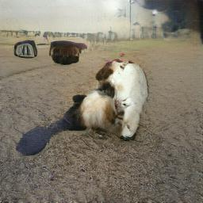

# LAFITE 프로젝트

본 저장소는 [LAFITE: Towards Language-Free Training for Text-to-Image Generation](https://arxiv.org/abs/2111.13792) 논문을 바탕으로 MS-COCO 2014 데이터셋을 사용하여 Language-free 방식으로 학습을 수행하는 과정을 안내합니다.

원본 LAFITE 깃허브 저장소는 [여기](https://github.com/drboog/Lafite/tree/main?tab=readme-ov-file)에서 확인할 수 있습니다.

## 필자의 실험 환경

* GPU: NVIDIA RTX 3090
* CUDA: 11.3
* CPU: intel Core i7-10700K
* RAM: 32GB
* 운영체제: Windows 10

## 사전 요구사항

다음과 같은 패키지를 설치해야 합니다. 패키지 설치 과정에서 어려움을 겪지 않도록 필자가 직접 준비한 `requirements.txt` 파일을 사용하시면 편리합니다.

```bash
pip install -r requirements.txt
```

## 데이터셋 준비

MS-COCO 2014 데이터셋을 다운받아야 합니다.

```bash
curl -O http://images.cocodataset.org/zips/train2014.zip
curl -O http://images.cocodataset.org/zips/val2014.zip
```

압축을 풀어줍니다. **폴더 구조를 반드시 확인하세요.**

## 데이터 전처리

`dataset_tool.py`를 이용해 데이터를 전처리합니다.

```bash
python dataset_tool.py --source=./train2014 --dest=./train2014.zip --width=256 --height=256
python dataset_tool.py --source=./val2014 --dest=./val2014.zip --width=256 --height=256
```

## 학습 실행

학습 스크립트는 다음과 같이 실행합니다.

```bash
python train.py --gpus=1 --outdir=./outputs/ \
--data=./datasets/train2014.zip --test_data=./datasets/val2014.zip \
--temp=0.5 --itd=10 --itc=10 --gamma=10 \
--mixing_prob=1.0 --mirror=1 --kimg=100 --batch=32 --workers=4 \
--metrics=fid50k_full --snap=2
```

이 데이터셋으로 빠른 테스트 학습이 가능합니다.

## 환경 설정 관련 이슈

학습 중 PyTorch CUDA 관련 플러그인 설치 오류 (`bias_act_plugin`, `upfirdn2d_plugin`)가 발생할 경우 다음을 수행하세요.

### 문제 해결 방법

1. Visual Studio 2019 버전 설치 (2022 버전은 사용하지 않음)
2. 시스템 환경 변수에 Visual Studio 2019의 경로를 가장 상단에 설정
3. Ninja 패키지 설치

```bash
pip install ninja
```

위의 방법으로 해결되지 않을 경우, 다음을 수행하세요:

* 이전 학습 시 생성된 캐시 파일 삭제 (`*.pkl`):

```
C:\Users\사용자\.cache\dnnlib\gan-metric\*.pkl
```

삭제 후 재실행하면 오류가 해결됩니다.

## 학습 과정 로그 설명

학습 로그에서 각 항목의 의미는 다음과 같습니다.

* `tick`: 체크포인트 주기
* `kimg`: 누적 학습 이미지 수 (천 단위)
* `sec/tick`: 체크포인트 주기당 소요 시간 (초)
* `maintenance`: 이미지 저장, 평가 등 비학습 작업 시간
* `cpumem`: CPU 메모리 사용량
* `gpumem`: GPU 메모리 사용량
* `augment`: 데이터 증강 확률 (보통 0.000)

## 모델 파라미터 공유

인터넷상에 공개된 pretrained 모델이 없기 때문에, 필자가 직접 6000 kimg 학습한 모델 파라미터를 `.pkl` 형태로 공유합니다.

## 생성 이미지 예시



`.generated.jpg`는 필자가 공유한 6000 kimg 학습된 모델 파라미터로 "photo of dog" 문장으로 이미지를 생성한 예시입니다. 실제 논문에서는 25000 kimg를 학습했으므로 보다 고품질의 이미지가 생성되지만, 필자의 실험 환경 특성상 6000 kimg 학습에도 약 3일이 걸렸습니다. 해당 이미지는 `generate.py`를 이용하여 임의로 생성된 것입니다.


## 추가 논문 참고

Diffusion을 이용한 Language-free 모델 등 최근의 연구도 존재하므로, 이러한 논문도 함께 참고하시면 좋습니다.

* [Shifted Diffusion 모델](https://github.com/drboog/Shifted_Diffusion)

## 추가 정보

원본 LAFITE 깃허브 저장소는 [여기](https://github.com/drboog/Lafite/tree/main?tab=readme-ov-file)에서 확인할 수 있습니다.

## 모델 파라미터 공유

인터넷상에 공개된 pretrained 모델이 존재하지 않기 때문에, 필자가 직접 6000 kimg 학습한 모델 파라미터를 공유합니다.

- 🔗 [학습된 모델 다운로드 (.pkl)](https://drive.google.com/file/d/1Q5eejlKAtA8kiyaAVct55GxQoN6-FwH7/view?usp=sharing)

해당 모델은 6000 kimg까지 학습된 상태이며, "photo of dog" 같은 문장에 대해 `.generated.jpg`와 같은 이미지를 생성할 수 있습니다.

# LAFITE Project(EN)

This repository is based on the paper [LAFITE: Towards Language-Free Training for Text-to-Image Generation](https://arxiv.org/abs/2111.13792), and provides a guide to training the model in a language-free manner using the MS-COCO 2014 dataset.

The original LAFITE GitHub repository can be found [here](https://github.com/drboog/Lafite/tree/main?tab=readme-ov-file).

## Experimental Environment

* GPU: NVIDIA RTX 3090
* CUDA: 11.3
* CPU: intel Core i7-10700K
* RAM: 32GB
* OS: Windows 10

## Requirements

To avoid dependency issues, a `requirements.txt` file is provided for easy setup.

```bash
pip install -r requirements.txt
```

## Dataset Preparation

Download the MS-COCO 2014 dataset:

```bash
curl -O http://images.cocodataset.org/zips/train2014.zip
curl -O http://images.cocodataset.org/zips/val2014.zip
```

Unzip the files. **Make sure the folder structure is correct.**

## Data Preprocessing

Use `dataset_tool.py` to preprocess the dataset:

```bash
python dataset_tool.py --source=./train2014 --dest=./train2014.zip --width=256 --height=256
python dataset_tool.py --source=./val2014 --dest=./val2014.zip --width=256 --height=256
```

## Training

To start training, run the following command:

```bash
python train.py --gpus=1 --outdir=./outputs/ \
--data=./datasets/train2014.zip --test_data=./datasets/val2014.zip \
--temp=0.5 --itd=10 --itc=10 --gamma=10 \
--mixing_prob=1.0 --mirror=1 --kimg=100 --batch=32 --workers=4 \
--metrics=fid50k_full --snap=2
```


## Troubleshooting Environment Issues

If you encounter PyTorch CUDA plugin compilation errors such as `bias_act_plugin` or `upfirdn2d_plugin`, follow these steps:

### How to Resolve

1. Install Visual Studio 2019 (do not use 2022)
2. Set the Visual Studio 2019 path at the top of the system environment variables
3. Install the `ninja` package:

```bash
pip install ninja
```

If that doesn't solve the problem, delete the cache files generated during previous training runs:

```
C:\Users\<username>\.cache\dnnlib\gan-metric\*.pkl
```

Then rerun the training script.

## Understanding Training Logs

* `tick`: Checkpoint interval
* `kimg`: Number of images trained (in thousands)
* `sec/tick`: Time per checkpoint (in seconds)
* `maintenance`: Time spent on non-training tasks (e.g., saving images)
* `cpumem`: CPU memory usage
* `gpumem`: GPU memory usage
* `augment`: Data augmentation probability (usually 0.000)

## Pretrained Model Sharing

Since no pretrained model is publicly available online, I am sharing my own trained model after 6000 kimg. The model file is provided in `.pkl` format.

## Generated Image Example

The `.generated.jpg` file was created using the 6000 kimg trained model shared above, conditioned on the prompt "photo of dog." While the original paper trained for 25000 kimg, this model was trained only up to 6000 kimg due to hardware limitations (which took approximately 3 days). The image was generated using a modified `generate.py` script.

## Further References

There are more recent studies using diffusion-based models for language-free generation. One such promising method is:

* [Shifted Diffusion](https://github.com/drboog/Shifted_Diffusion)

We recommend referring to such works as well to stay up to date.

## Additional Resources

The original LAFITE GitHub repository is available [here](https://github.com/drboog/Lafite/tree/main?tab=readme-ov-file).

## pkl
📦 [Download 6000kimg-trained LAFITE model (.pkl)](https://drive.google.com/file/d/1Q5eejlKAtA8kiyaAVct55GxQoN6-FwH7/view?usp=sharing)

